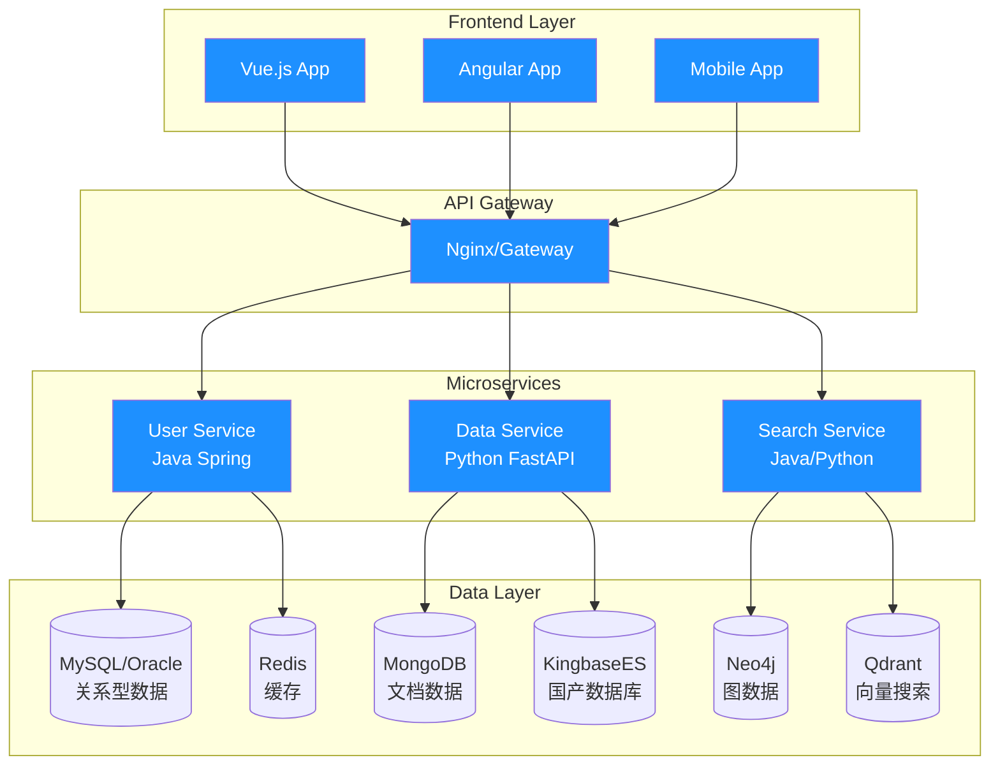

<div align="center">
  
</div>

<h1 align="center">
  
  你好，我是 Anarkh-Lee 全栈开发者 
  
</h1>

<div align="center">
  
</div>

## 🌟 关于我

```javascript
const developer = {
  name: "IT全栈开发者",
  role: "Full Stack Developer & Database Architect",
  location: "中国 🇨🇳",
  motto: "用代码构建数字世界的桥梁",
  
  passion: [
    "🏗️ 微服务架构设计",
    "🤖 AI驱动的智能应用", 
    "📊 大数据处理与分析",
    "🔍 向量检索与语义搜索"
  ],
  
  currentlyLearning: [
    "云原生技术栈",
    "向量数据库优化",
    "图神经网络"
  ]
};
```

## 🛠️ 技术宇宙

<div align="center">

### � 编程语言
<p align="center">
  
  
  
  
</p>

### 🚀 后端框架
<p align="center">
  
  
  
  
</p>

### 🎨 前端技术
<p align="center">
  
  
  
  
  
</p>

### 💾 关系数据库
<p align="center">
  
  
  
  
</p>

### 📊 NoSQL & 特殊存储
<p align="center">
  
  
  
  
</p>

### 🧠 向量数据库 & AI
<p align="center">
  
  
  
  
</p>

### ☁️ 云服务与部署
<p align="center">
  
  
  
  
</p>

### 🔧 开发工具
<p align="center">
  
  
  
  
  
</p>

</div>

## 📊 代码统计

<div align="center">
  
  
</div>

<div align="center">
  
</div>

## 🏆 成就展示

<div align="center">
  
</div>

## 🎯 技术架构



## 🚀 精选项目

<div align="center">

### 💎 核心作品
[](https://github.com/Anarkh-Lee/anarkh-faq-py3)
[](https://github.com/Anarkh-Lee/auth-demos)

</div>

## 📈 贡献活动

<div align="center">
  
</div>

## 💡 技能矩阵

<div align="center">

| 🏷️ 技术领域        | 🛠️ 主要技术栈                               | 📈 熟练程度      | 🎯 应用场景                |
|:------------------:|:-------------------------------------------|:----------------:|:-------------------------|
| **☕ 后端开发**      | Java, Spring Boot, Python, FastAPI        |  | 微服务架构, API开发        |
| **🎨 前端开发**      | Vue.js, Angular, TypeScript, React        |  | SPA应用, 响应式设计       |
| **💾 关系数据库**    | Oracle, MySQL, PostgreSQL, KingbaseES     |  | 数据建模, 性能优化        |
| **📊 NoSQL**        | MongoDB, Redis, Elasticsearch             |  | 缓存设计, 文档存储        |
| **🕸️ 图数据库**      | Neo4j, 图算法                             |  | 关系分析, 推荐系统        |
| **🧠 向量数据库**    | Qdrant, Pinecone, 语义搜索                |  | AI检索, 相似度匹配       |
| **☁️ 云原生**       | Docker, Kubernetes, AWS, 阿里云            |  | 容器化, 微服务编排       |
| **🤖 AI/ML**        | TensorFlow, OpenAI API, 模型集成           |  | 智能应用, 自动化         |

</div>

## 🌐 联系方式

<div align="center">

### 📬 让我们连接数字世界的桥梁

<p align="center">
  <a href="mailto:anarkhlee@gmail.com">
    
  </a>
  <a href="https://github.com/Anarkh-Lee">
    
  </a>
  <a href="https://anarkh.site">
    
  </a>
</p>

</div>

<div align="center">
  
  
  
  
</div>

<div align="center">

### ✨ *"用代码连接世界，让技术改变未来"* ✨

  
</div>