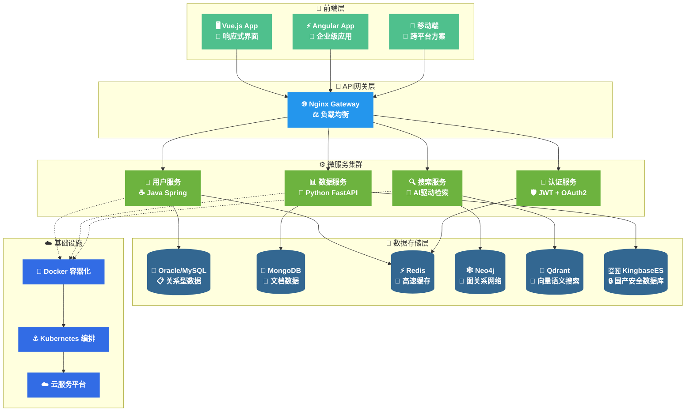

  

<h1 align="center">
  
  你好，我是 Anarkh-Lee 全栈开发者 
  
</h1>

  

## 🌟 关于我

<!-- 技术热情和学习方向 -->

<table>
  <tr>
    <td align="center" width="50%">
      
        
      
       
      
       
      
       
      
    </td>
    <td align="center" width="50%">
      
        
      
       
      
       
      
       
      
    </td>
  </tr>
</table>

 

<!-- 个人理念 -->

## 🛠️ 技术宇宙

### � 编程语言

  
  
  
  

### 🚀 后端框架

  
  
  
  

### 🎨 前端技术

  
  
  
  
  

### 💾 关系数据库

  
  
  
  

### 📊 NoSQL & 特殊存储

  
  
  
  

### 🧠 向量数据库 & AI

  
  
  
  

### ☁️ 云服务与部署

  
  
  
  

### 🔧 开发工具

  
  
  
  
  

## 📊 代码统计

### 🎆 GitHub 数据概览

<table>
  <tr>
    <td width="50%">
      
    </td>
    <td width="50%">
      
    </td>
  </tr>
</table>

### 🔥 连续贡献统计

  

## 🏆 成就展示

### 🌟 GitHub 成就奖杯

  

### 📈 贡献数据分析

<table>
  <tr>
    <td align="center" width="25%">
      
       仓库数量
    </td>
    <td align="center" width="25%">
      
       提交次数
    </td>
    <td align="center" width="25%">
      
       获得星标
    </td>
    <td align="center" width="25%">
      
       关注者
    </td>
  </tr>
</table>

## 🎯 技术架构

## 🚀 精选项目

### 💎 核心作品

<table style="border: none; background: linear-gradient(135deg, #f5f7fa 0%, #c3cfe2 100%); border-radius: 15px; padding: 20px;">
  <tr>
    <td width="50%" style="border: none; padding: 15px;">
      

        
        

          
           
          
          
        

      

    </td>
    <td width="50%" style="border: none; padding: 15px;">
      

        
        

          
           
          
          
        

      

    </td>
  </tr>
</table>

### 📊 项目统计

  
  
  

## 📈 贡献活动

### 🎆 年度活动统计

  

### 📅 活动数据概览

<table>
  <tr>
    <td align="center" width="25%">
      

        
         <small>代码提交</small>
      

    </td>
    <td align="center" width="25%">
      

        
         <small>连续贡献</small>
      

    </td>
    <td align="center" width="25%">
      

        
         <small>历史最高</small>
      

    </td>
    <td align="center" width="25%">
      

        
         <small>总贡献数</small>
      

    </td>
  </tr>
</table>

## 💡 技能矩阵

<table>
  <tr>
    <th>🏷️ 技术领域</th>
    <th>🛠️ 主要技术栈</th>
    <th>📈 熟练程度</th>
    <th>🎯 应用场景</th>
  </tr>
  <tr>
    <td><strong>☕ 后端开发</strong></td>
    <td>Java, Spring Boot, Python, FastAPI</td>
    <td></td>
    <td>微服务架构, API开发</td>
  </tr>
  <tr>
    <td><strong>🎨 前端开发</strong></td>
    <td>Vue.js, Angular, TypeScript, React</td>
    <td></td>
    <td>SPA应用, 响应式设计</td>
  </tr>
  <tr>
    <td><strong>💾 关系数据库</strong></td>
    <td>Oracle, MySQL, PostgreSQL, KingbaseES</td>
    <td></td>
    <td>数据建模, 性能优化</td>
  </tr>
  <tr>
    <td><strong>📊 NoSQL</strong></td>
    <td>MongoDB, Redis, Elasticsearch</td>
    <td></td>
    <td>缓存设计, 文档存储</td>
  </tr>
  <tr>
    <td><strong>🕸️ 图数据库</strong></td>
    <td>Neo4j, 图算法</td>
    <td></td>
    <td>关系分析, 推荐系统</td>
  </tr>
  <tr>
    <td><strong>🧠 向量数据库</strong></td>
    <td>Qdrant, Pinecone, 语义搜索</td>
    <td></td>
    <td>AI检索, 相似度匹配</td>
  </tr>
  <tr>
    <td><strong>☁️ 云原生</strong></td>
    <td>Docker, Kubernetes, AWS, 阿里云</td>
    <td></td>
    <td>容器化, 微服务编排</td>
  </tr>
  <tr>
    <td><strong>🤖 AI/ML</strong></td>
    <td>TensorFlow, OpenAI API, 模型集成</td>
    <td></td>
    <td>智能应用, 自动化</td>
  </tr>
</table>

## 🌐 联系方式

### 📬 让我们连接数字世界的桥梁

  
  
  

  
  
  
  

### ✨ *"用代码连接世界，让技术改变未来"* ✨

  

